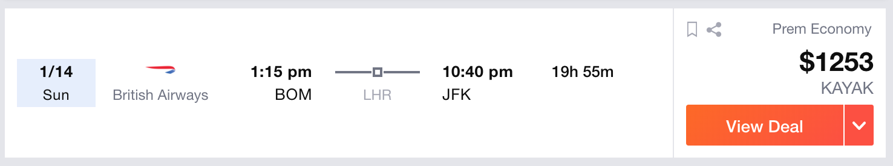

In this assignment, we will design an algorithm that will give us the cheapest flights from source to destination. We will use real flight prices from kayak.com and develop our own DP algorithm that will give us a sequence of flights whose total cost is cheaper than the cheapest (one/multi-stop) flight on kayak.com


First, we will consider a smaller problem. Imagine that there are only 6 airports in the world and only 5 airlines.

NOTE: DO NOT CHANGE THE CODE HERE. ONLY FILL CODE IN FUNCTIONS WHERE IT IS ASKED.

```{r}
airports <- c('BOM', 'NYC', 'DXB', 'LHR', 'FRA', 'DOH')
airlines <- c('AIR_INDIA', 'BRITISH_AIRWAYS', 'EMIRATES', 
            'QATAR_AIRWAYS', 'LUFTHANSA')
```

Read data from csv files containing flight prices. Each csv is named after an airport. The prices in that csv correspond to prices for DIRECT FLIGHT, FROM that airport. The columns of the csv represent airline chosen and ROWS represent the DESTINATION

```{r}
setwd("/Users/jamiesoh/Development/osu/osu-mach-learn/module-3/assignment_3/")
#setwd("/Users/hughj/Development/osu/osu-mach-learn/module-3/assignment_3/")

read_csv <- function(file_name) {
  temp <- read.csv(file_name)
  temp2 <- temp[,-1]
  rownames(temp2) <- temp$X
  temp2
}

BOM <- read_csv("BOM.csv")
NYC <- read_csv("NYC.csv")
DXB <- read_csv("DXB.csv")
LHR <- read_csv("LHR.csv")
FRA <- read_csv("FRA.csv")
DOH <- read_csv("DOH.csv")

price_matrix = list(BOM, NYC, DXB, LHR, FRA, DOH) # This is same order as airports
```

## Q1: Write a function that returns the lowest cost of direct flight from BOM to NYC (3 points)

Fill the function below
```{r}
lowest_cost_direct <- function(from, to){
    rowx <- price_matrix[[from]][to,]
    minx <- 1
    posx <- 1
    while (posx <= ncol(rowx)){
      if (rowx[posx] < rowx[minx]) minx <- posx
      posx <- posx + 1
    }
    rowx[minx]
  }

lowest_cost_BOM_to_NYC_direct <- function() {
  # Write your code here
  index_of_from <- which(airports=="BOM")[1]
  index_of_to <- which(airports=="NYC")[1]
  lowest_cost_direct(index_of_from, index_of_to)
}

(lowest_cost_BOM_to_NYC_direct())
```

## Q2: Write a function that returns the lowest cost of direct flight from one airport to another (2 points)

Fill the function below
```{r}
lowest_cost_direct_flight <- function(from, to) {
  # Write your code here
  # First get index of FROM airport to check which 
  # data frame from price matrix to use
  # Since airports array and price_matrix has same order of airports
  index_of_from <- which(airports==from)[1]
  prices_from <- price_matrix[index_of_from][[1]]
  
  # Write your code here
  lowest_cost_direct(index_of_from, to)
}

(lowest_cost_direct_flight('BOM', 'NYC'))
```

## Q3: Given an array of airports, write a function that outputs the lowest cost to travel from each airport in the array to any airport in the same array. The output should be an NxN matrix where N is length of array of airports. Note that diagonal elements will be 0 (5 points)

Fill the function below
```{r}
lowest_cost_direct_flight_matrix <- function(airports) {
  # Write your code here
  num_ports <- length(airports)
  mx <- matrix(0, num_ports,num_ports)
  rownames(mx) <- airports
  colnames(mx) <- airports
  for (p in 1:num_ports){
    for (j in 1:num_ports){
      mx[p,j] = lowest_cost_direct(p,j)[1,1]
    }
  }
  mx
}
options(scipen=999)
(lowest_cost_direct_flight_matrix(airports))
```

## Q4. Here comes the main question. Find the cheapest flight from any airport to any airport which may or maynot be direct flight. (6 points)

Fill the function below
```{r}
lowest_cost_flight_matrix <- function(airports, max_layovers) {
  # Write your code here
  # create the matrix of all possible (fr,to) combinations:
  
  # helper function to calculate the cost.  we keep the total cost for the path in accum.
  helper <- function(fr,to, vect, hops, accum){
    # terminal condition: hops==0
    if (hops == 0) accum + lowest_cost_direct_flight(fr, to)
    else {
      # not a direct flight. calculate the costs of all possible previous layovers
      layovers <- vect[!(vect %in% c(fr,to))]  # we should get a vector here
      if (length(layovers) < 1) stop
      # if layover==1, we couls have a-b-e, a-c-e, a-d-e.  we have to add the cost of the
      # tail to the cost of the rest of the flight, then take the minimum.
      fff<-sapply(layovers, function(s){helper(fr, s, vect[!(vect %in% s)],hops-1, accum) + 
          helper(s, to, vect[!(vect %in% s)],hops-1, accum)})
      sapply(fff,min)
    }
  }
  #helper("NYC","BOM", airports, max_layovers, 0)
  msize <- length(airports)
  mx <- matrix(0, msize, msize, dimnames = list(airports, airports))
  for (i in airports){
    ix <- which(airports == i)[1]
    for (j in airports){
      jx <- which(airports == j)[1]
      if (i == j) mx[ix, jx] <- 0
      else mx[ix,jx] <- helper(i, j, airports, max_layovers, 0)
    }
  }
  mx
}
(lowest_cost_flight_matrix(c("NYC","BOM"), 0))
```


Now lets check the lowest prices when max_layover is 1 and compare them with max_layover = 0 (direct flights). 

```{r}
(lowest_cost_flight_matrix(airports,1))
(lowest_cost_flight_matrix(airports,0))
```

Lets directly print a dataframe of dollars saved by increasing max_layover. Note that the optimal flight could also be a direct flight.

```{r}
(lowest_cost_flight_matrix(airports,0)-lowest_cost_flight_matrix(airports,1))
```

Note that the large numbers in dollars saved are because there was no direct flight but there were one stop flights, so technically you saved the cost of building and flying your own long range Boeing 747

We see that the lowest direct flight from BOM to NYC is \$1300 (which is actual price on kayak.com) and one stop flight is \$990. Lets see what kayak gives as the cheapest one stop flight of BOM to NYC for same dates.

We see that our algorithm gives much cheaper flights than online websites! Take BOM to LHR by BRITISH_AIRWAYS then take LHR to NYC by AIR_INDIA for a total of just \$990.

 <!-- .element width="50%" -->
 <!-- .element width="50%" -->

Try changing max_layovers to 2. You will see a significant increase in runtime! The technique of memoization solves this (Memoization was demonstrated in python tutorial).

##Q5. (Bonus Question) Try to use memoization

```{r}
faster_lowest_cost_flight_matrix <- function(airports, max_layovers) {
  
}
```

##Q6. (Bonus Question) What will happen if you try to increase number of states? Hint: Read curse of dimensionality in Dynamic Programming

```{r}
faster_lowest_cost_flight_matrix <- function(airports, max_layovers) {
  
}
```

Now build your own website that offers cheapest flight tickets for patient customers that are willing to wait for their requests!